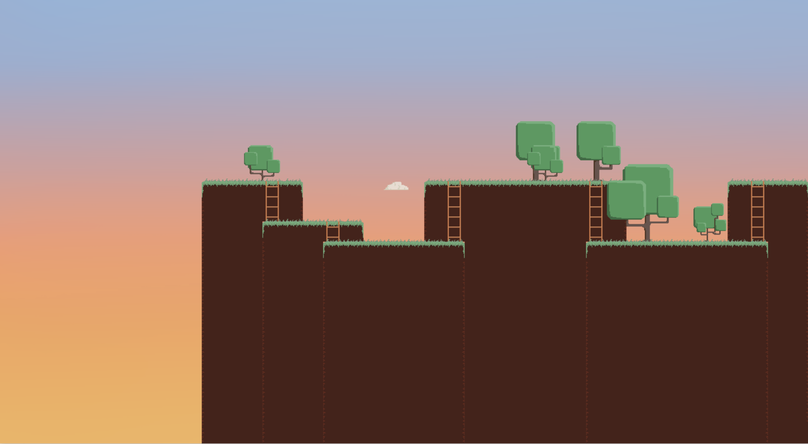

# C_PlatformGenerator
<i>Platform graphic (and ascii as well) generator made in C</i>
### Final result:

### In the code somethings can be seted such as:
- width & height
- tree density
- borders limit
- background
